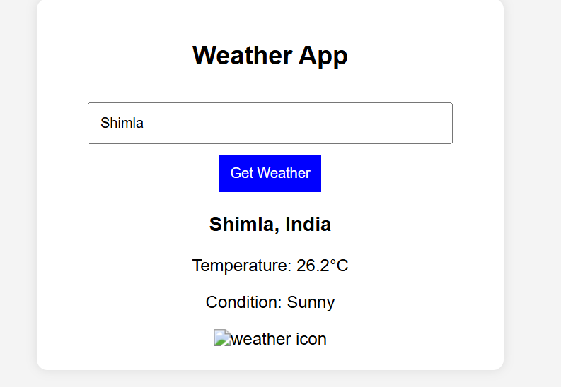

# 🌦️ WeatherApp

**WeatherApp** is a simple, user-friendly weather forecasting application that allows users to search for real-time weather updates for any city around the globe. Built using HTML, CSS, and JavaScript, this project fetches live weather data using the [OpenWeatherMap API](https://openweathermap.org/api) and displays current weather conditions such as temperature, humidity, wind speed, and weather description.

## 🔧 Features

* 🌍 Search weather information by city name
* 📡 Fetch real-time weather data using OpenWeatherMap API
* 🌡️ Display temperature, humidity, wind speed, and weather conditions
* 🖼️ Clean and responsive user interface
* 🔄 Automatically updates data upon new city search

## 🚀 Technologies Used

* **HTML** – Structure of the app
* **CSS** – Styling and layout
* **JavaScript** – API handling and dynamic content update
* **OpenWeatherMap API** – Source of real-time weather data

## 📸 Screenshot

> 

## 🛠️ How to Use

1. Clone the repository:

   ```bash
   git clone https://github.com/Pallabi26313/WeatherApp.git
   ```
2. Navigate to the project directory:

   ```bash
   cd WeatherApp
   ```
3. Open `index.html` in any browser:

   ```bash
   open index.html
   ```
4. Enter a city name and press **Enter** or click the **Search** button to view current weather.

## 🌐 Live Demo

> *(If hosted online using GitHub Pages or other platforms, add the live link here)*
> [View Live Demo](#)

## 💡 Future Improvements

* Add forecast for upcoming days
* Improve UI/UX with animations and modern design
* Implement location-based auto-detection for weather
* Add loading indicators and error handling for invalid city names

## 🤝 Contributing

Feel free to fork the repository and submit pull requests. Any contributions to improve the app are welcome!

---
